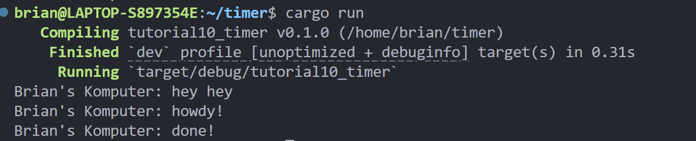

# Reflection

## 1.2 Understanding how it works. 



```rust
fn main() {
    let (executor, spawner) = new_executor_and_spawner();

    spawner.spawn(async {
        println!("Brian's Komputer: howdy!");
        TimerFuture::new(Duration::new(2, 0)).await;
        println!("Brian's Komputer: done!");
    });

    println!("Brian's Komputer: hey hey");
    
    drop(spawner);
    executor.run();
}
```

Async tasks are not executed when they are created; instead, they are simply placed in a queue. The synchronous print statement "hey hey" runs immediately, after which the spawner is dropped. Then the `executor.run()` initiates the processing of the queued async tasks.